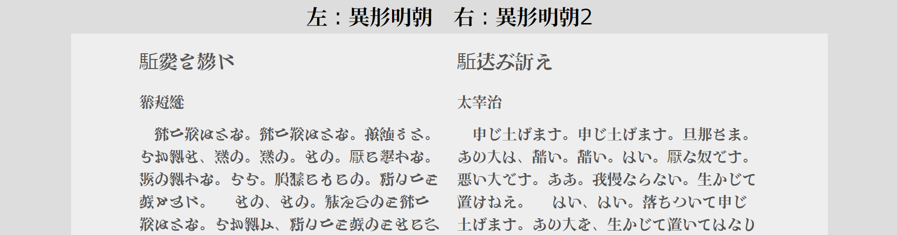

## Saluton!
> テクノなまこ、科学の力。

### works
- [AI生成カラーフォント自動改札 A, B, C](https://github.com/Mikanixonable/IgyouMincho/tree/main/ttf/color)

- [異形明朝](https://github.com/Mikanixonable/IgyouMincho/tree/main/ttf/IgyouMincho)

- [playground](https://mikanixonable.github.io/18)

### Social
- [Misskey](https://misskey.io/@Mikanixonable)
- [Bluesky](https://bsky.app/profile/mikanixonable.bsky.social)
- [Twitter](https://twitter.com/Mikanixonable)
- [others...](https://bento.me/miku)

### My House

*** 最近更新したページ
リーマンのフラクタル

<!--
**Mikanixonable/Mikanixonable** is a ✨ _special_ ✨ repository because its `README.md` (this file) appears on your GitHub profile.

Here are some ideas to get you started:

- 🔭 I’m currently working on ...
- 🌱 I’m currently learning ...
- 👯 I’m looking to collaborate on ...
- 🤔 I’m looking for help with ...
- 💬 Ask me about ...
- 📫 How to reach me: ...
- 😄 Pronouns: ...
- ⚡ Fun fact: ...
-->
